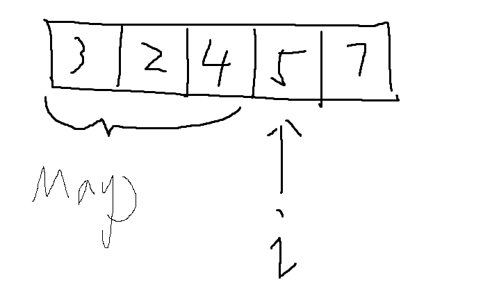

# Leetcode 1 两数之和 （哈希表）

> 给定一个整数数组 `nums` 和一个整数目标值 `target`，请你在该数组中找出 **和为目标值** *`target`* 的那 **两个** 整数，并返回它们的数组下标。
>
> 你可以假设每种输入只会对应一个答案。但是，数组中同一个元素在答案里不能重复出现。
>
> 你可以按任意顺序返回答案。
>
> **示例 1：**
>
> ```
> 输入：nums = [2,7,11,15], target = 9
> 输出：[0,1]
> 解释：因为 nums[0] + nums[1] == 9 ，返回 [0, 1] 。
> ```
>
> **示例 2：**
>
> ```
> 输入：nums = [3,2,4], target = 6
> 输出：[1,2]
> ```
>
> **示例 3：**
>
> ```
> 输入：nums = [3,3], target = 6
> 输出：[0,1]
> ```

## 题目分析

拿到这个题，我的第一反应是，这可以用两重循环去解决，对于一个数i，然后循环遍历i之后的数字，判断有没有其它数字与其相加为target，说干就干，上代码

```java
class Solution {
    public int[] twoSum(int[] nums, int target) {
        int[] result = new int[2];
        for (int i = 0; i < nums.length; i++) {
            for (int j = i+1; j < nums.length; j++) {
                if(nums[i] + nums[j] == target){
                    result[0] = i;
                    result[1] = j;
                    return result;
                }
            }
        }

        return result;
    }
}
```

毫无疑问，这种方式效率是极低的，时间复杂度应该是o(nlogn)级别，仔细观察可以发现，外层的循环无法避免，也就是至少时间复杂度为O(n)，那有没有办法把内层循环去掉，用一个O(1)的算法去替换呢？

答案是有的，想到O(1)，自然而然就会想到哈希表

再次审视题干发现，其实我们最终要确定的那个数字其实是target-i，不一定是j，所以我们只需要判断哈希表中是否存在target-i这个数字就可以，如果不存在，就把当前的i放进哈希表

这就像什么呢，这就像循环遍历整个数组，然后遍历到i的时候，看看i前面有没有存在一个数满足target-i，所以后面的这个找数字的操作是由哈希表完成的，时间复杂度为O(1)

<center></center>

ok，直接上代码

```java
class Solution {
    public int[] twoSum(int[] nums, int target) {
        Map<Integer, Integer> map = new HashMap<>();

        for (int i = 0; i < nums.length; i++) {
            if(map.containsKey(target- nums[i])){
                return new int[]{i, map.get(target-nums[i])};
            }else{
                map.put(nums[i], i);
            }
        }

        return new int[]{0};
    }
}
```

我们之所以可以把数字放到key进行存储，是因为题目说了数组中同一个元素在答案里不能重复出现

如果数组中元素有重复

那就不能放在key位置进行存储了