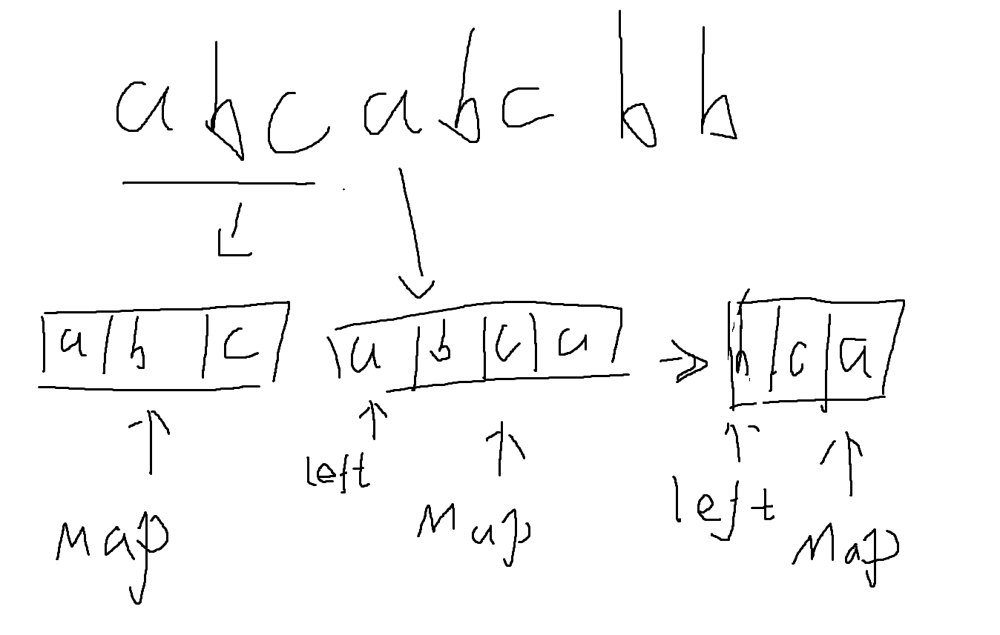

# Leetcode 1 两数之和 （哈希表）

> 给定一个整数数组 `nums` 和一个整数目标值 `target`，请你在该数组中找出 **和为目标值** *`target`* 的那 **两个** 整数，并返回它们的数组下标。
>
> 你可以假设每种输入只会对应一个答案。但是，数组中同一个元素在答案里不能重复出现。
>
> 你可以按任意顺序返回答案。
>
> **示例 1：**
>
> ```
> 输入：nums = [2,7,11,15], target = 9
> 输出：[0,1]
> 解释：因为 nums[0] + nums[1] == 9 ，返回 [0, 1] 。
> ```
>
> **示例 2：**
>
> ```
> 输入：nums = [3,2,4], target = 6
> 输出：[1,2]
> ```
>
> **示例 3：**
>
> ```
> 输入：nums = [3,3], target = 6
> 输出：[0,1]
> ```

## 题目分析

拿到这个题，我的第一反应是，这可以用两重循环去解决，对于一个数i，然后循环遍历i之后的数字，判断有没有其它数字与其相加为target，说干就干，上代码

## 代码实现

```java
class Solution {
    public int[] twoSum(int[] nums, int target) {
        int[] result = new int[2];
        for (int i = 0; i < nums.length; i++) {
            for (int j = i+1; j < nums.length; j++) {
                if(nums[i] + nums[j] == target){
                    result[0] = i;
                    result[1] = j;
                    return result;
                }
            }
        }

        return result;
    }
}
```

## 再分析

毫无疑问，这种方式效率是极低的，时间复杂度应该是o(nlogn)级别，仔细观察可以发现，外层的循环无法避免，也就是至少时间复杂度为O(n)，那有没有办法把内层循环去掉，用一个O(1)的算法去替换呢？

答案是有的，想到O(1)，自然而然就会想到哈希表

再次审视题干发现，其实我们最终要确定的那个数字其实是target-i，不一定是j，所以我们只需要判断哈希表中是否存在target-i这个数字就可以，如果不存在，就把当前的i放进哈希表

这就像什么呢，这就像循环遍历整个数组，然后遍历到i的时候，看看i前面有没有存在一个数满足target-i，所以后面的这个找数字的操作是由哈希表完成的，时间复杂度为O(1)

<center></center>

ok，直接上代码

## 代码实现

```java
class Solution {
    public int[] twoSum(int[] nums, int target) {
        Map<Integer, Integer> map = new HashMap<>();

        for (int i = 0; i < nums.length; i++) {
            if(map.containsKey(target- nums[i])){
                return new int[]{i, map.get(target-nums[i])};
            }else{
                map.put(nums[i], i);
            }
        }

        return new int[]{0};
    }
}
```

我们之所以可以把数字放到key进行存储，是因为题目说了数组中同一个元素在答案里不能重复出现

如果数组中元素有重复

那就不能放在key位置进行存储了


# Leetcode 2 两数相加 （链表）

> 给你两个 **非空** 的链表，表示两个非负的整数。它们每位数字都是按照 **逆序** 的方式存储的，并且每个节点只能存储 **一位** 数字。
>
> 请你将两个数相加，并以相同形式返回一个表示和的链表。
>
> 你可以假设除了数字 0 之外，这两个数都不会以 0 开头。
>
> ```
> 输入：l1 = [2,4,3], l2 = [5,6,4]
> 输出：[7,0,8]
> 解释：342 + 465 = 807.
> ```
>
> **示例 2：**
>
> ```
> 输入：l1 = [0], l2 = [0]
> 输出：[0]
> ```
>
> **示例 3：**
>
> ```
> 输入：l1 = [9,9,9,9,9,9,9], l2 = [9,9,9,9]
> 输出：[8,9,9,9,0,0,0,1]
> ```

## 题目分析

这个题目其实算是比较简单的，对位相加而已，关键在于进位怎么去处理

如果两个数字相加大于或等于10，那么肯定就会产生1的进位，并且当前位置保留个位

思路就是

遍历两个链表，并且定义一个k作为进位保存变量

如果发现l1.val+l2.val+k大于等于10，那么就说明产生了进位，定义一个节点并保存个位数字，k赋值1

如果小于10，那么说明没有产生进位，直接保存数字，k赋值0

记住一定要给k进行赋值

最后还要判断一下，是否有链表没有遍历完，按照上面的逻辑再走遍

最后一个坑就是，如果遍历到最后，两个链表都遍历完毕，还得判断以下k的值，如果为1，那说明最后也产生了进位，需要补上

## 代码实现

```java
class Solution {
    public ListNode addTwoNumbers(ListNode l1, ListNode l2) {
        ListNode head = new ListNode(0);
        ListNode res = head;
        int k = 0;
        while(l1 != null && l2 != null){
            ListNode node = null;
            if(l1.val + l2.val + k >= 10){
                int num = (l1.val + l2.val + k) % 10;
                k = 1;
                node = new ListNode(num);
            }else{
                node = new ListNode(l1.val + l2.val + k);
                k = 0;
            }
            head.next = node;
            head = head.next;
            l1 = l1.next;
            l2 = l2.next;
        }

        while(l1 != null){
            ListNode node = null;
            if(l1.val + k >= 10){

                int num = (l1.val + k) % 10;
                node = new ListNode(num);
                k = 1;
            }else{

                node = new ListNode(l1.val + k);
                k = 0;
            }
            head.next = node;
            head = head.next;
            l1 = l1.next;
        }

        while(l2 != null){
            ListNode node = null;
            if(l2.val + k >= 10){

                int num = (k + l2.val) % 10;
                node = new ListNode(num);
                k = 1;
            }else{

                node = new ListNode(l2.val + k);
                k = 0;
            }
            head.next = node;
            head = head.next;
            l2 = l2.next;
        }

        if(k != 0){
            ListNode node = new ListNode(k);
            head.next = node;
        }

        return res.next;
    }
}
```


# Leetcode 3 无重复字符的最长子串 （滑动窗口）

> 给定一个字符串 `s` ，请你找出其中不含有重复字符的 **最长子串** 的长度。
>
> 
>
> **示例 1:**
>
> ```
> 输入: s = "abcabcbb"
> 输出: 3 
> 解释: 因为无重复字符的最长子串是 "abc"，所以其长度为 3。
> ```
>
> **示例 2:**
>
> ```
> 输入: s = "bbbbb"
> 输出: 1
> 解释: 因为无重复字符的最长子串是 "b"，所以其长度为 1。
> ```
>
> **示例 3:**
>
> ```
> 输入: s = "pwwkew"
> 输出: 3
> 解释: 因为无重复字符的最长子串是 "wke"，所以其长度为 3。
>      请注意，你的答案必须是 子串 的长度，"pwke" 是一个子序列，不是子串。
> ```

## 题目分析

拿到这个题目后，可能一般来说第一反应是可以用暴力求解，弄两个for循环配合一个hashmap即可解决，但是这样做太慢了，所以可以分析一下题干

题目要求是不重复的最长子串，假如我们把子串看成一个队列，那么这个队列里面必须只有不重复的元素，比如示例1，当队列为abc的时候，满足题意，然后再进一个abca，不满足题意了，这个时候就要记录一下abc的长度，并且把最左边的a排出去，然后右边继续添加元素，这是不是就很像一个队列在滑动的向前走

<center></center>

所以整个流程应该是这样的：

1. 定义一个map，max，left
2. 循环遍历字符串
3. 如果发现map中存在当前字符，将left右移到重复元素的下一位
4. 记录当前长度和max作比较
5. 进入下一次循环

## 代码实现

```java
class Solution {
    public int lengthOfLongestSubstring(String s) {
        Map<Character, Integer> map = new HashMap<>(16);
        int max = 0;
        int left = 0;

        for (int i = 0; i < s.length(); i++) {
            if(map.containsKey(s.charAt(i))){
                left = Math.max(left, map.get(s.charAt(i)) + 1);
            }

            map.put(s.charAt(i), i);
            max = Math.max(max, i-left+1);
        }

        return max;
    }
}
```

注意这个left是要移动到重复元素的下一位，所以是map.get(s.charAt(i)) + 1

这个时候可能会产生疑问，就算你left移动了，但是你map中的元素还是存在的，比如pwwepw

你的队列到pww的时候，肯定要把pw都舍去，这个时候left应该指向w，但是你的map中还是存在p这个字符

这个时候就要靠这条代码了 left = Math.max(left, map.get(s.charAt(i)) + 1)

map记录的时候字符和其所在的下标，也就是说left其实取的是最大的那个下标，就算后面到了wep的字符p时，会去进入这条语句，那么这个p在map中的下标之前就存放的是0，明显是要小于left的，所以left不会变，然后走完这条语句，map就会更新这个字符的下标，所以现在p的下标就不是0了

这条语句的作用用一句话概括就是 防止之前的离开队列的元素对现在的判断产生影响，这也就是为什么要取一个最大值，不直接left = map.get(s.charAt(i)) + 1的原因


# Leetcode 6 Z字形变化（字符串）

> 将一个给定字符串 `s` 根据给定的行数 `numRows` ，以从上往下、从左到右进行 Z 字形排列。
>
> 比如输入字符串为 `"PAYPALISHIRING"` 行数为 `3` 时，排列如下：
>
> ```
> P   A   H   N
> A P L S I I G
> Y   I   R
> ```
>
> 之后，你的输出需要从左往右逐行读取，产生出一个新的字符串，比如：`"PAHNAPLSIIGYIR"`。
>
> 请你实现这个将字符串进行指定行数变换的函数：
>
> ```
> string convert(string s, int numRows);
> ```
>
> 
>
> **示例 1：**
>
> ```
> 输入：s = "PAYPALISHIRING", numRows = 3
> 输出："PAHNAPLSIIGYIR"
> ```
>
> **示例 2：**
>
> ```
> 输入：s = "PAYPALISHIRING", numRows = 4
> 输出："PINALSIGYAHRPI"
> 解释：
> P     I    N
> A   L S  I G
> Y A   H R
> P     I
> ```
>
> **示例 3：**
>
> ```
> 输入：s = "A", numRows = 1
> 输出："A"
> ```

## 题目分析

第一时间想到的是暴力模拟求解，题目说是Z字形变换，那么也就是说我们只需要模拟一个Z字形的遍历过程即可

定义一个list代表行，然后一开始是从上向下遍历，遍历到头之后就是从下往上遍历，一直遍历完整个字符串

假设有n行，那么应该就是s[1] - s[n] 然后 s[n] - s[1] 这样依次去遍历

## 代码实现

```java
class Solution {
    public String convert(String s, int numRows) {
        //如果只有一行或者0行，那么就说明不需要处理什么，直接返回s即可
        if(numRows < 2) return s;
        //这里定义一个list，泛型指定为StringBuilder，用来定义每一行的字符串
        List<StringBuilder> lists = new ArrayList<>();
        //初始化每一行字符串
        for (int i = 0; i < numRows; i++) {
            lists.add(new StringBuilder());
        }

        //j代表当前是第几行
        int j = 0;
        //定义一个flag，用于区分我们当前是要向下走还是向上走
        boolean flag = true;
        for (int i = 0; i < s.length(); i++) {
            //将当前字母加入即可
            lists.get(j).append(s.charAt(i));
            //如果flag为真，那么说明当前是要向下走阶段，j++，反之则j--
            if(flag) j++;
            else j--;
            //如果j大于了numrows-1，说明当前走到头了，需要向上走了
            if(j > numRows - 1){
                //由于最后一行已经添加过了，所以不能重复添加，从倒数第二行开始
                j = numRows - 2;
                //置为false代表需要向上走
                flag = false;
            }
            //如果j小于0了，说明向上走到头了，需要向下走了
            if(j < 0){
                //一样的道理，第一行已经添加过了，需要从第二行开始
                j = 1;
                //置为true代表需要向下走
                flag = true;
            }
        }
        //最后将每一行的字符串拼接在一起进行返回
        String res = "";
        for (StringBuilder builder : lists) {
            res += builder;
        }

        return res;
    }
}
```

```cmd
解答成功:
	执行耗时:9 ms,击败了39.43% 的Java用户
	内存消耗:44.3 MB,击败了58.41% 的Java用户
```

在leetcode题解中，看到了一位网友是以数学找规律的思维解决这道题

我们一开始都是以s的视角去看，想着遍历s，但是能不能直接把一行的规律找出来，这样循环也就会循环行数的次数，时间就会大大减少

这位大佬找到了一行的规律，对于一个z字形，一行中只会有numrows， numrows+x，numrows+x+y三个

其中x可以通过numrows*2-2计算出来，然后依次递减2，y从0开始依次递增2

最后只需要判断一下一行中的下标有没有越界即可

原帖地址：[耗时更低](https://leetcode.cn/problems/zigzag-conversion/solutions/2740724/hao-shi-geng-di-by-cranky-6oodallzgz-87zf)

```cmd
解答成功:
	执行耗时:1 ms,击败了100.00% 的Java用户
	内存消耗:43.7 MB,击败了84.55% 的Java用户
```


# Leetcode 7 整数反转

> 给你一个 32 位的有符号整数 `x` ，返回将 `x` 中的数字部分反转后的结果。
>
> 如果反转后整数超过 32 位的有符号整数的范围 `[−231,  231 − 1]` ，就返回 0。
>
> **假设环境不允许存储 64 位整数（有符号或无符号）。**
>
> 
>
> **示例 1：**
>
> ```
> 输入：x = 123
> 输出：321
> ```
>
> **示例 2：**
>
> ```
> 输入：x = -123
> 输出：-321
> ```
>
> **示例 3：**
>
> ```
> 输入：x = 120
> 输出：21
> ```
>
> **示例 4：**
>
> ```
> 输入：x = 0
> 输出：0
> ```

## 题目分析

这题题干非常简单，就是将一个整数反转后输出，但是需要注意的是，反转后可能会超出32位有符号整数的范围，如果超出了就要返回0

所以这题主要是分析超出范围的情况，本身难度不是很大，用取模运算就可以拿到每一位的值

## 代码实现

```java
class Solution {
    public int reverse(int x) {
        int res = 0;
        while(x!=0) {
            //每次取末尾数字
            int tmp = x%10;
            // 判断是否 大于 最大32位整数
            if (res>214748364 || (res==214748364 && tmp>7)) {
                return 0;
            }
            //判断是否 小于 最小32位整数
            if (res<-214748364 || (res==-214748364 && tmp<-8)) {
                return 0;
            }
            res = res*10 + tmp;
            x /= 10;
        }
        return res;
    }
}
```
